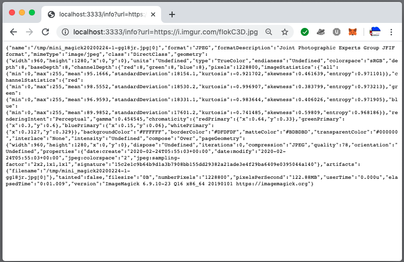
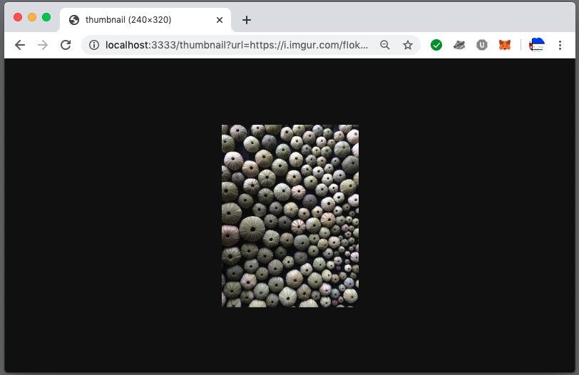

# Ruby

Sinatra API

Two endpoints:

1. An endpoint which will validate your file is an image and return key metadata (filetype, size, dimensions)

```http://localhost:3333/info?url=https://i.imgur.com/fIokC3D.jpg```

```json
{"name":"/tmp/mini_magick20200224-1-gg18jr.jpg[0]","format":"JPEG","formatDescription":"Joint Photographic Experts Group JFIF format","mimeType":"image/jpeg","class":"DirectClass","geometry":{"width":960,"height":1280,"x":0,"y":0},"units":"Undefined","type":"TrueColor","endianess":"Undefined","colorspace":"sRGB","depth":8,"baseDepth":8,"channelDepth":{"red":8,"green":8,"blue":8},"pixels":1228800,"imageStatistics":{"all":{"min":0,"max":255,"mean":95.1666,"standardDeviation":18154.1,"kurtosis":-0.921702,"skewness":0.461639,"entropy":0.971101}},"channelStatistics":{"red":{"min":0,"max":255,"mean":98.5552,"standardDeviation":18530.2,"kurtosis":-0.996907,"skewness":0.383799,"entropy":0.973213},"green":{"min":0,"max":255,"mean":96.9593,"standardDeviation":18331.1,"kurtosis":-0.983644,"skewness":0.406026,"entropy":0.971905},"blue":{"min":0,"max":255,"mean":89.9852,"standardDeviation":17601.2,"kurtosis":-0.741485,"skewness":0.59809,"entropy":0.968186}},"renderingIntent":"Perceptual","gamma":0.454545,"chromaticity":{"redPrimary":{"x":0.64,"y":0.33},"greenPrimary":{"x":0.3,"y":0.6},"bluePrimary":{"x":0.15,"y":0.06},"whitePrimary":{"x":0.3127,"y":0.329}},"backgroundColor":"#FFFFFF","borderColor":"#DFDFDF","matteColor":"#BDBDBD","transparentColor":"#000000","interlace":"None","intensity":"Undefined","compose":"Over","pageGeometry":{"width":960,"height":1280,"x":0,"y":0},"dispose":"Undefined","iterations":0,"compression":"JPEG","quality":78,"orientation":"Undefined","properties":{"date:create":"2020-02-24T05:55:03+00:00","date:modify":"2020-02-24T05:55:03+00:00","jpeg:colorspace":"2","jpeg:sampling-factor":"2x2,1x1,1x1","signature":"15c2e1c9b64b9d1a3b7908bb155dd29382a21ade3e4f29ba6409e0395044a140"},"artifacts":{"filename":"/tmp/mini_magick20200224-1-gg18jr.jpg[0]"},"tainted":false,"filesize":"0B","numberPixels":"1228800","pixelsPerSecond":"122.88MB","userTime":"0.000u","elapsedTime":"0:01.009","version":"ImageMagick 6.9.10-23 Q16 x86_64 20190101 https://imagemagick.org"}
```



2. An endpoint which will return a resized version of your image. Image resized to 25%.

```http://localhost:3333/thumbnail?url=https://i.imgur.com/fIokC3D.jpg```



### TODO

* Docker container doesn't live reload in development with code update. Needs to be rebuilt each time.

### Code

#### Endpoints

```ruby 
# app.rb

get '/info' do
  content_type :json
  MiniMagick::Image.open(params['url']).data.to_json
end

get '/thumbnail' do
  image = MiniMagick::Image.open params['url']
  image.resize "25%"
  send_file open(image.path,
    type: image.data["mimeType"],
    disposition: 'inline'
  )
end

# Exception handling code ...

```

#### Request specs

```ruby
# ./spec/app_spec.rb

  it 'displays image meta data' do
    get '/info', url: dummy_image_url_stubbed
    # The http request is stubbed with the identical
    # dummy image. Testing the content-type is the
    # only meaningful test of behaviour here.
    expect(last_response.content_type).to eq("application/json")
  end

  it 'resizes dummy image to 25%' do
    get '/thumbnail', url: dummy_image_url_stubbed
    expect(last_response.content_type).to eq("image/jpeg")

    dummy_image = MiniMagick::Image.open(dummy_image_path)
    response_image = MiniMagick::Image.read(last_response.body)

    expect(response_image.width).to eq dummy_image.width * 0.25
  end
	
  it 'displays image meta data' do
    get '/info', url: dummy_image_url_stubbed
    # The http request is stubbed with the identical
    # dummy image. Testing the content-type is the
    # only meaningful test of behaviour here.
    expect(last_response.content_type).to eq("application/json")
  end

  it 'resizes dummy image to 25%' do
    resize_factor = 0.25
    get '/thumbnail', url: dummy_image_url_stubbed

    expect(last_response.content_type).to eq("image/jpeg")

    dummy_image = MiniMagick::Image.open(dummy_image_path)
    response_image = MiniMagick::Image.read(last_response.body)
    expect(response_image.width).to eq dummy_image.width * resize_factor
  end

	# Exception Handling
  it 'handles open(params["url"]) not found' do
    get '/thumbnail', url: 'http://url-not-found-stubbed.com/foo.jpg'
    expect(last_response.status).to eq 400
  end

  it 'handles invalid images' do
    get '/thumbnail', url: 'http://invalid-image-url-stubbed.com/foo.txt'
    #get '/thumbnail', url: dummy_image_url_stubbed
    expect(last_response.status).to eq 400
  end

  ### The Request specs below implicitly test the underlying
  ### behaviour of ParameterValidation.
  it 'handles invalid urls' do
    get '/thumbnail', url: 'htttttttttp://invalid-url.com'
    expect(last_response.status).to eq 400
  end

  it 'handles blank urls' do
    get '/thumbnail', url: '' # blank
    expect(last_response.status).to eq 400
  end

  it 'handles absent url params' do
    get '/thumbnail' # no params
    expect(last_response.status).to eq 400
  end	
```

### Exception handling

```ruby
# app.rb
error MiniMagick::Invalid do
  status 400
  body "400 Bad Request. Invalid image: '#{env['sinatra.error'].message}'"
end
```

```
$ curl http://localhost:3333/info\?url\=http://www.gutenberg.org/cache/epub/61481/pg61481.txt
400 Bad Request. Invalid image: '`identify /tmp/mini_magick20200225-1-68vpvn.txt` failed with error:
identify-im6.q16: improper image header `/tmp/mini_magick20200225-1-68vpvn.txt' @ error/txt.c/ReadTXTImage/450.`'
```

---

```ruby
# app.rb
error OpenURI::HTTPError do
  # OpenURI::HTTPError is from MiniMagick::Image.open.
  # MiniMagick requires OpenURI.

  # When a valid params['url'] leads to a 404 response.
  # The params['url'] was bad. This is a bad request
  # from the client => 400 error.
  status 400
  body "400 Bad Request. Requested resource '#{params['url']}' is unavailable."
end
```

```
$ curl http://localhost:3333/info\?url\=https://i.imgur.com/responds_with_404.jpg
400 Bad Request. Requested resource 'https://i.imgur.com/responds_with_404.jpg' is unavailable.
```

---

```ruby
# ./lib/parameter_validation.rb

module ParameterValidation

  def self.valid_url!(url)
    blank!(url)
    valid_uri!(url)
  end

  class Error < StandardError
    def initialize(msg="URL is invalid.", exception_type="custom")
      @exception_type = exception_type
      super(msg)
    end
  end

  def self.valid_uri!(url)
    uri = URI.parse(url)
    if !uri.is_a?(URI::HTTP) || uri.host.nil?
      raise Error.new 'URL is malformed.'
    end
  end

  def self.blank!(str)
    if str.nil? || str.empty?
      raise Error.new 'Requires URL parameter.'
    end
  end
end

```

```ruby
# app.rb
error ParameterValidation::Error do
  # Badly formed URL passed as a param.
  status 400
  body '400 Bad Request. Absent or malformed parameters.'
end
```

```
$ curl http://localhost:3333/info\?url\=htttttttttttps://i.imgur.com/fIokC3D.jpg
400 Bad Request. Absent or malformed parameters.
```

```
$ curl http://localhost:3333/info\?url\=
400 Bad Request. Absent or malformed parameters.
```

```
$ curl http://localhost:3333/info\?
400 Bad Request. Absent or malformed parameters.
```

```
$ curl http://localhost:3333/info
400 Bad Request. Absent or malformed parameters.
```

```
$ curl http://localhost:3333/info\?url\=https://i.imgur.com/$$$$fIokC3D.jpg
400 Bad Request. Absent or malformed parameters.
```

### Install

#### Force into Production environment
```cp env.production.sample .env```

Note: Without a `.env` file, Sinatra defaults to Development environment.

#### Build Docker container
```docker-compose up --build```

#### Run the tests
```docker-compose run web bundle exec rspec```

#### Run container with Pry enabled
```docker-compose run --service-ports web```

### Curl

```curl http://localhost:3333/info\?url\=https://i.imgur.com/fIokC3D.jpg```

```curl http://localhost:3333/thumbnail\?url\=https://i.imgur.com/fIokC3D.jpg```

